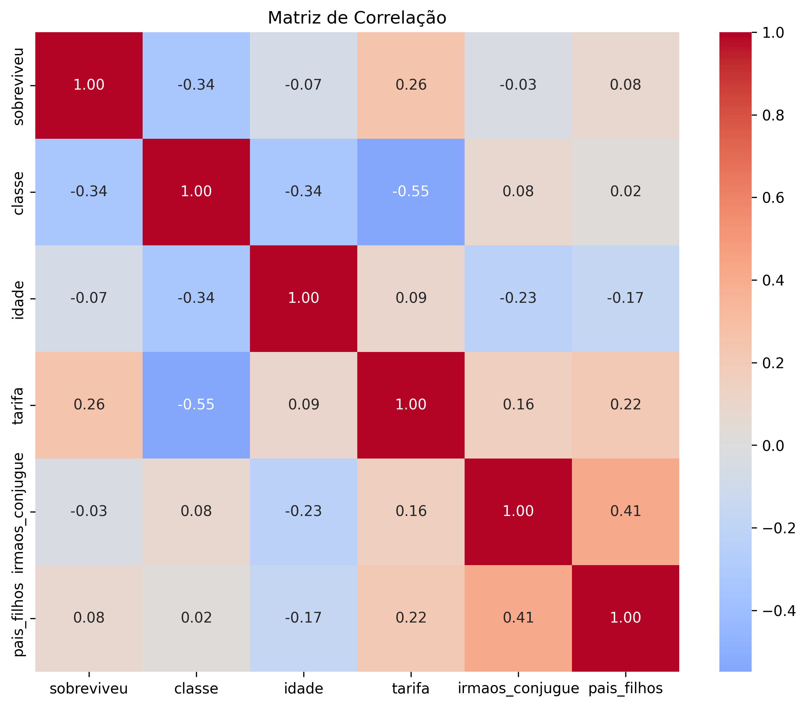
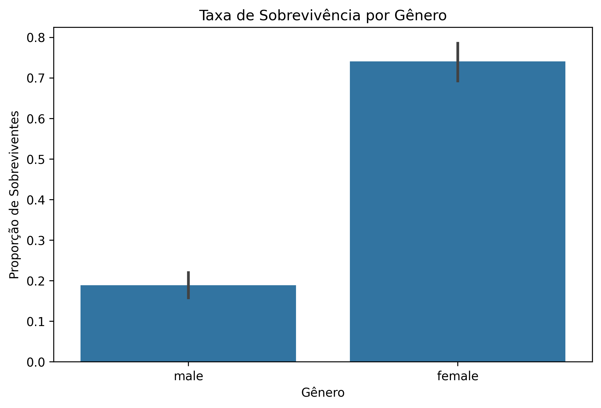
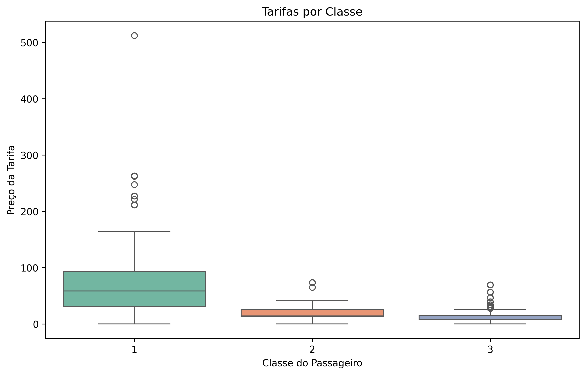
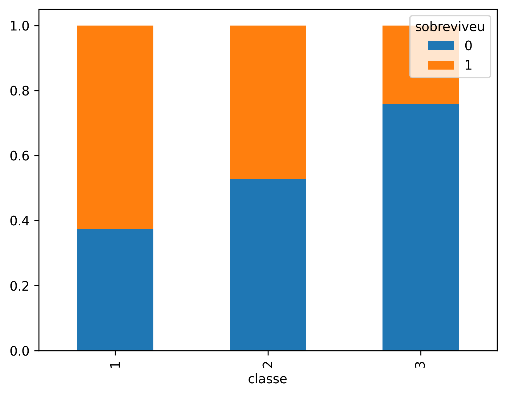

# Relatório de Análise Exploratória de Dados - Titanic

## 1. Descrição do Projeto
Este projeto analisa os dados dos passageiros do Titanic para identificar padrões que influenciaram a sobrevivência. Trabalho desenvolvido como parte da Atividade Prática Extra da Trilha de Ciência de Dados do programa SCTEC 2026.

## 2. Tecnologias Utilizadas
- **Jupyter Notebook/VS Code:** Ambiente de desenvolvimento.

- **Python 3.x**

- **Pandas:** Limpeza e manipulação de dados.

- **Seaborn:** Visualização de dados estatísticos.

- **Matplotlib:** Personalização de gráficos e layouts.

## 3. Decisões Tomadas e Etapas do projeto
- **Importação:** Dados fornecidos através do Descritivo da atividade prática fornecido no AVA e carregados via biblioteca Pandas.

- **Limpeza de Dados:**
    - **Remoção da coluna 'Cabin':** Decidi removê-la pois não é uma informação relevante em relação à sobrevivência e continha mais de 77% de valores nulos, o que prejudicaria a análise estatística.
    - **Tratamento de 'Age' (Idade):** Preenchi os valores ausentes com a **mediana** (28 anos) para evitar distorções causadas por valores extremos.
    - **Tratamento de 'Embarked':** Removi as duas linhas com valores nulos por representarem uma parcela mínima do dataset.
- **Organização:** Traduzi os nomes das colunas para Português para facilitar a leitura e o storytelling.

## 3. Principais Insights (Resultados)

1. **Fator Socioeconómico:** A classe social e o valor da tarifa foram determinantes. Passageiros da 1ª classe tiveram uma taxa de sobrevivência consideravelmente maior.

2. **Prioridade de Resgate:** Os dados confirmam que mulheres e crianças tiveram prioridade, conforme evidenciado nos gráficos de género e idade.

3. **Gênero:** Confirmação visual da política "mulheres e crianças primeiro", com uma taxa de sobrevivência muito maior para o gênero feminino. 

4. **Estrutura Familiar:** Identificou-se uma forte correlação entre as colunas de parentesco, indicando a presença de muitos núcleos familiares a bordo.

## 4. Visualizações Incluídas
O projeto conta com:

- Matriz de Correlação (Heatmap).

- Gráfico de Barras de Sobrevivência por Gênero.

- Boxplot de Tarifas por Classe (com análise de outliers).

- Gráfico de Barras Empilhadas de Sobrevivência por Classe.

## 5. Como rodar o projeto

1. Certifique-se de ter o Python instalado.

2. Instale as bibliotecas necessárias:
    - ``pip install pandas seaborn matplotlib``

3. Mantenha o arquivo titanic_dataset.csv na mesma pasta.

4. Execute o arquivo ``.ipynb`` ou ``.py``.

## 6. Conclusão

Os dados analisados mostram que o desastre do Titanic não foi um evento de sorte aleatória para os sobreviventes. Houve um recorte social e econômico claro, onde a classe e o gênero foram os principais determinantes para a sobrevivência. 